# J-Lens Reasoning

An experimental system for investigating how long-context reasoning changes in
model representations, using Jacobian Lens readouts and controlled residual
interventions.

When the same reasoning problem is embedded in a longer context, what changes
inside the model—and are candidate representation changes related to the
resulting answer behavior? This repository builds the infrastructure to study
that question on [FLenQA](https://aclanthology.org/2024.acl-long.818/), while
keeping behavioral measurements, interpretability readouts, and intervention
hypotheses separate.

The current public tree is stronger evidence of research engineering than of
scientific outcomes: model-backed outputs are external to the repository and
no generated run artifact is committed here. The README therefore describes
what is implemented and tested, and labels empirical conclusions as pending
until versioned artifacts are published.

## Research question

When a matched FLenQA problem is presented at increasing nominal context
lengths, does the model's internal readout distribution change at the relevant
facts, question, or answer positions? If candidate changes are found with
Jacobian Lens, do targeted coordinate interventions change answer behavior in
the predicted direction?

This is an investigation of a possible mechanism. It is not a claim that
Jacobian Lens currently explains long-context failure, or that an intervention
that changes an output constitutes reliable reasoning recovery.

## Approach

```mermaid
flowchart LR
    A[FLenQA matched reasoning problems] --> B[Short / long prompt variants]
    B --> C[Deterministic model inference]
    C --> D[Jacobian Lens + Logit Lens readouts]
    D --> E[Compare layers and labeled positions]
    E --> F[Candidate drift or probe directions]
    F --> G[Coordinate intervention pilots]
    G --> H[Measure answer and rank changes]
    H -. tests a relationship .-> I[Evidence for or against the hypothesis]
```



The central comparison uses independently tokenized prompts. A short prompt is
not padded to align it with a long prompt: fact, question, sampled-padding, and
final-prompt positions are resolved explicitly in each prompt's own token
coordinates.

## What I built

- A typed FLenQA data layer for the three task families (PIR, MonoRel, and
  Simplified RuleTaker), including exact task prompt templates, schema checks,
  the published full-dataset invariants, SHA-256 prompt IDs, deduplication, and
  source-row provenance.
- Position-aware token assets that resolve key fact spans, question ends,
  sampled non-fact context positions, and the final input position while
  rejecting over-length prompts instead of silently truncating them.
- A paired Jacobian/Logit Lens runner that records typed Parquet `prompts`,
  `positions`, and `topk` tables. It checks tokenization, vocabulary/layer
  compatibility, and equality of the model logits returned by both lens modes.
- Separate behavioral evaluation contracts: raw generation capture and
  deterministic chat inference, paper-compatible FLenQA binary verdict
  scoring, and constrained next-token rank comparisons. The evaluation policy
  keeps extraction gold-blind and distinguishes generation, reasoning, and
  answer status.
- A frozen FLenQA linear-probe workflow: split 300 underlying problems at the
  problem level into 180/60/60 train/validation/test partitions, fit one
  centered L2 logistic probe per transformer layer using only 250/500-token
  train/validation rows, and evaluate the frozen direction on held-out
  context lengths.
- J-Lens residual coordinate swap and patch hooks with explicit layer,
  position, direction, and alpha controls. The sanity experiment also defines
  identity, matched-norm random-vector, wrong-concept, and random-target
  controls.
- Colab execution with commit markers, locked dependency export, generic
  artifact paths, and model-free offline CI. Generated data, model weights,
  lens checkpoints, and run outputs stay outside Git.

## Current evidence

The repository currently contains implementation evidence, not a public result
release. Every tracked notebook is saved without outputs or execution counts,
and the public tree contains no committed model-generated Parquet/JSON results
or report. The numbers below are workflow contracts asserted by code, not
headline experimental findings.

| Area | What is implemented | Public status |
| --- | --- | --- |
| Behavioral | FLenQA prompt preparation, deterministic direct chat inference, raw model-output schema, and paper-compatible binary scoring | Implemented and unit-tested; no evaluated model-output artifact committed |
| Readout | Jacobian/Logit Lens top-k extraction at labeled positions, bounded Parquet streaming, and descriptive drift analysis | Implemented with structural tests; no top-k result artifact committed |
| Probe | Frozen problem-level split, per-layer probes, validation-selected regularization, held-out evaluation, and AUROC diagnostics | Implemented in Colab notebooks; no probe checkpoint or output report committed |
| Intervention | Qwen J-Lens sanity swaps plus FLenQA coefficient and concept-selection pilots | Implemented with core mechanics and control logic; no intervention result artifact committed |

The notebooks contain assertions that validate dataset counts, prompt coverage,
position coverage, and artifact shapes when run. Those assertions establish
the experimental contract; they do not establish that a model run passed or
that the hypothesis is true.

## What the results do not show

The current public repository does not justify the following conclusions:

- that model accuracy decreases on this repository's Qwen/FLenQA run;
- that a particular layer or token is a causal explanation for a failure;
- that coordinate interventions recover reasoning rather than merely changing
  a next-token rank or output;
- that a probe's decodability means the model uses that information causally;
- that the Qwen3.5-4B setup replicates the Anthropic/Claude experiments; or
- that the complete model-backed experiment is reproducible from Git alone.

The absence of committed outputs is deliberate in this presentation pass. A
future result release should include the exact model, lens, dataset revision,
code commit, decoding settings, artifact schema, and analysis report alongside
any numerical claim.

## Experiments

### 1. J-Lens read-and-change sanity check — implemented, run outputs not public

[`experiments/jlens_readout_sanity/jlens_readout_sanity.ipynb`](experiments/jlens_readout_sanity/jlens_readout_sanity.ipynb)
loads the open [Qwen/Qwen3.5-4B](https://huggingface.co/Qwen/Qwen3.5-4B)
model with the released `qwen-n1000` Qwen3.5-4B Jacobian Lens checkpoint from
[Neuronpedia](https://github.com/neuronpedia/jacobian-lens). It tests the
paper's `spider` → `ant` concept example and four `France` → `China` factual
swaps across capital, language, continent, and currency prompts.

The intended text-only result artifact is:

```text
runs/jlens-readout-sanity/
└── result.json
```

The experiment's code-defined gates require clean baseline answers, a spider
readout within rank 5 and ahead of the Logit Lens readout, minimum rank
improvements, at least one target at top-1, and passing negative controls. It
runs alpha 1 and alpha 2 conditions and records per-case ranks and provenance.
These are pass criteria, not a claim that the current public branch has met
them. This open-model setup is a sanity check, not a numerical replication of
the Anthropic/Claude paper. The `Qwen sanity threshold` is an experiment gate,
and the paper gap is explicit: this repository does not claim a Claude result.

### 2. FLenQA behavior by context length — implemented, results pending

The FLenQA runner validates the published evaluation split, renders the
authors' task-specific prompt templates, retains source-row provenance, and
deduplicates exact final prompt text. The full-run notebook is configured for
the published nominal lengths 250, 500, 1000, 2000, and 3000 tokens. Its
notebook assertions expect 12,000 source rows and 9,862 unique prompt records
for the saved model-output table; those are workload/integrity checks, not
observed accuracy results.

Model outputs preserve raw text, token IDs and pieces, chat inference mode,
decoding settings, wrapped input length, label, prompt provenance, and the
project commit. The accuracy notebook then applies the explicit FLenQA
paper-compatible final-occurrence `True`/`False` scorer and reports both
paper-weighted and unique-prompt summaries. No accuracy curve is included here
because the evaluated output table is not committed.

### 3. FLenQA J-Lens drift — implemented analysis, results pending

[`experiments/flenqa_lens_drift/flenqa_lens_drift.ipynb`](experiments/flenqa_lens_drift/flenqa_lens_drift.ipynb)
compares top-25 reciprocal-rank distributions against the shortest observed
length. It measures total variation at fact, question, sampled-padding, and
final-prompt positions; removes answer-interface tokens as a sensitivity
analysis; and computes a matched problem-level semantic score across the middle
layers. The notebook also prepares descriptive Spearman associations between
that score and model error or matched accuracy loss.

These are analysis definitions and safeguards, not reported drift findings.
The notebook explicitly treats missing top-k mass as missing coverage rather
than silently converting it to zero.

### 4. Frozen linear probes — implemented, held-out outputs pending

[`notebooks/flenqa_probe_assets.ipynb`](notebooks/flenqa_probe_assets.ipynb)
freezes a problem-level 60/20/20 split stratified by task and label. It fits
one binary L2 logistic probe per transformer layer from the final input-token
residual state, selects regularization on validation log loss, and never loads
test activations during asset creation.

[`notebooks/flenqa_probe_eval.ipynb`](notebooks/flenqa_probe_eval.ipynb)
applies those frozen probes to the 60 held-out problems at all five nominal
lengths. It compares raw score separability (AUROC), fixed-threshold probe
accuracy, and model accuracy, including problem-level failure summaries. A
probe prediction can show that an answer direction is decodable; it cannot by
itself show that the model used that direction.

### 5. Causal intervention pilots — implemented, results pending

[`experiments/flenqa_lens_drift/flenqa_lens_intervention.ipynb`](experiments/flenqa_lens_drift/flenqa_lens_intervention.ipynb)
selects matched 250/1000 prompt pairs, works at layer 2 and the explicit
`final_prompt` position, and tests coefficient movement in both directions for
`k` values 10, 25, and 50 with alpha 0, 0.5, and 1.0. The separate
[`flenqa_failure_concept_intervention.ipynb`](experiments/flenqa_lens_drift/flenqa_failure_concept_intervention.ipynb)
selects concepts per short-correct/long-wrong pair and tests restoring lost
concepts or injecting gained concepts with `k` values 1, 3, 5, and 10.

Both notebooks use each prompt's own activation sequence and position; they do
not align different-length sequences by fake padding. Their interpretation
rules define what would count as supportive in each direction, but no causal
result is claimed until an artifact is published and audited.

## Research status and next questions

Implemented now:

- the benchmark and artifact pipeline;
- explicit position and provenance tracking;
- behavioral scoring and reproducible inference contracts;
- frozen representation probes and held-out evaluation code; and
- intervention mechanics with controls and regression tests.

Still open:

- publish versioned model-backed outputs and a compact result report;
- run the current probe, drift, and intervention notebooks against the same
  committed code/model/lens/data provenance;
- test whether any readout shift survives answer-interface ablation and is
  associated with matched failures; and
- establish whether a candidate direction has a selective, repeatable causal
  effect rather than a generic perturbation effect.

## Technical architecture

- `src/jlens_reasoning/` — reusable Python package for configuration, runtime
  setup, inference, evaluation, artifacts, interventions, and FLenQA mechanics.
- `experiments/` — experiment-specific policies and Colab notebooks: the
  Qwen J-Lens sanity check and FLenQA drift/intervention pilots.
- `notebooks/` — shared Colab bootstrap, FLenQA benchmark drivers, accuracy
  analysis, and frozen probe creation/evaluation.
- `tests/` — CPU-only, model-free unit and notebook-structure tests.
- `artifacts/` — ignored local/Drive root for datasets, model/lens assets,
  checkpoints, and generated runs.

The project is a Python 3.11–3.13 package with `uv` locking, PyTorch,
Transformers, `jlens`, PyArrow, and optional experiment dependencies. The
reusable library is kept separate from notebook policy so new experiments can
reuse validated mechanics without introducing a registry.

## Reproducing the work

The local, model-free checks are:

```bash
uv sync --locked --extra experiment
uv run pytest
uv run ruff format --check .
uv run ruff check .
```

Model-backed experiments require external FLenQA data, model/lens assets, a
GPU Colab runtime, and the Drive bundle workflow. See
[`docs/REPRODUCING.md`](docs/REPRODUCING.md) for the setup order, artifact
layout, notebook sequence, and reproducibility boundary.

## Code tour

- [`dataset.py`](src/jlens_reasoning/benchmarks/flenqa/dataset.py) — exact
  FLenQA templates, validation, prompt IDs, deduplication, and provenance.
- [`positions.py`](src/jlens_reasoning/benchmarks/flenqa/positions.py) —
  character-span to token-position resolution and deterministic padding samples.
- [`lens.py`](src/jlens_reasoning/benchmarks/flenqa/lens.py) — paired lens
  execution, deterministic top-k ordering, and model-logit consistency checks.
- [`runner.py`](src/jlens_reasoning/benchmarks/flenqa/runner.py) — bounded,
  non-resumable streaming writes to typed Parquet shards.
- [`interventions.py`](src/jlens_reasoning/experiments_utils/interventions.py)
  — J-Lens direction construction and residual coordinate hooks.
- [`experiment.py`](experiments/jlens_readout_sanity/experiment.py) — typed
  sanity cases, readouts, interventions, gates, and provenance.
- [`flenqa_probe_assets.ipynb`](notebooks/flenqa_probe_assets.ipynb) — frozen
  problem split and per-layer probe checkpoint creation.
- [`flenqa_probe_eval.ipynb`](notebooks/flenqa_probe_eval.ipynb) — held-out
  probe/model comparisons and non-causal interpretation diagnostics.

## Testing and reproducibility

GitHub Actions runs the locked environment, Ruff format/lint, and the full
CPU-only test suite on Ubuntu 3.11/3.12 and macOS 3.11. CI disables W&B and
uses offline Hugging Face/Transformers settings; it tests imports, pure
functions, mocked setup, artifact schemas, evaluation policy, interventions,
and notebook structure. It does not download models, access credentials, or
launch Colab.

The Colab path records a project commit marker and dirty-tree marker in its
uploaded bundle. Generated outputs remain external, so exact scientific
reproduction requires the matching assets and the saved run provenance in
addition to this repository.

## Attribution

- [Anthropic's `jacobian-lens` implementation](https://github.com/anthropics/jacobian-lens)
  provides the upstream `jlens` package and Jacobian Lens method. This
  repository pins the dependency to a specific Git revision and builds the
  FLenQA runners, analysis, and intervention experiments around it.
- [FLenQA / “Same Task, More Tokens”](https://aclanthology.org/2024.acl-long.818/)
  is the external benchmark and research basis. The original authors' code is
  available in [their repository](https://github.com/alonj/Same-Task-More-Tokens);
  this repository implements the typed loading, provenance, position assets,
  evaluation path, and J-Lens analyses used here.
- The [Qwen3.5-4B model](https://huggingface.co/Qwen/Qwen3.5-4B) and the
  [Neuronpedia Qwen J-Lens checkpoint](https://github.com/neuronpedia/jacobian-lens)
  are external assets. Their licenses and availability remain their
  respective owners' responsibility.
- The Python package, experiment policies, notebooks, tests, and analysis
  wiring in this repository are the work presented here.
